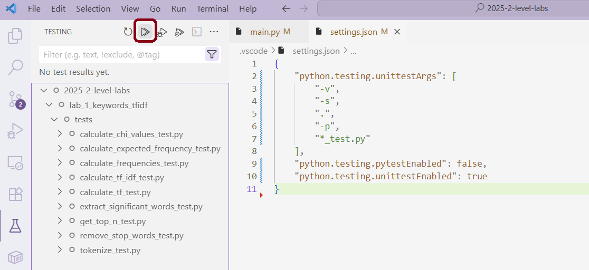
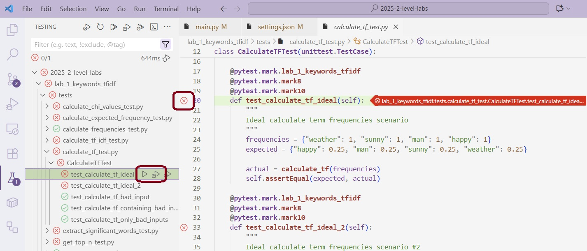
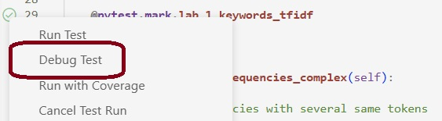
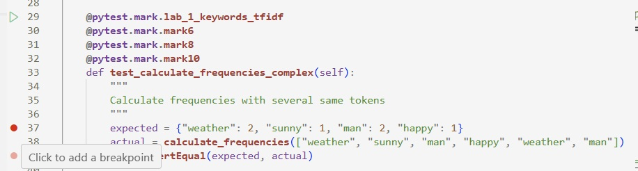
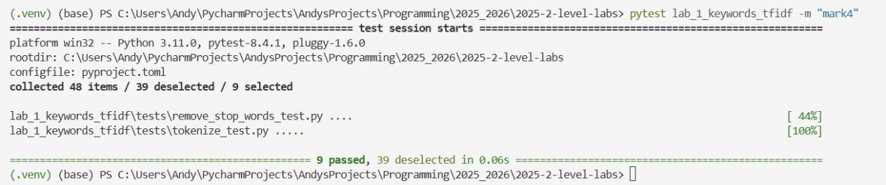
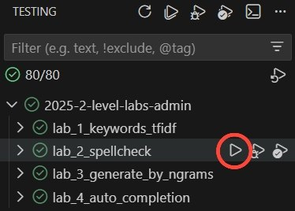

.. _running-tests-label:

.. contents:: Содержание:
   :depth: 2

Запуск тестов: локально и в CI
==============================

Настройка тестов в среде разработки Visual Studio Code
------------------------------------------------------

Чтобы настроить тесты локально, Вам потребуется выполнить следующие
шаги:

1. Установите зависимости для тестов:

   .. code:: bash

      python -m pip install -r requirements_qa.txt

.. important:: Удостоверьтесь, что у Вас активировано виртуальное окружение.
               Это делается через запуск команд ``.\venv\Scripts\activate``
               (Windows) или ``source venv\bin\activate`` (macOS) в терминале.

2. Создайте новую конфигурацию:

   Чтобы создать новую конфигурацию, откройте вкладку `Testing`
   на левой панели Visual Studio Code и нажмите кнопку
   `Configure Python Tests` button.

   .. image:: ../images/tests/vscode_testing_tab.png

   Иначе Вы можете открыть настройки конфигурации через командную строку
   Visual Studio Code.
   Используйте сочетание клавиш `Ctrl + Shift + P`, чтобы открыть
   командную строку. Наберите `Python: Configure Tests` в строке и
   выберите данную опцию в списке команд.

   .. image:: ../images/tests/vscode_command_bar.png

   Теперь Вы можете начать конфигурацию самих тестов.

3. Выберите опцию ``pytest``:

   .. image:: ../images/tests/vscode_tests_configuration_step_1.png

4. Выберите папку для запуска тестов:

   Вы можете использовать корневую папку проекта
   или папку нужной Вам лабораторной работы.

   .. image:: ../images/tests/vscode_tests_configuration_step_2.png

   После выбора Visual Studio Code откроет файл `settings.json`
   с параметрами конфигурации, а все тесты будут расположены на вкладке
   `Testing`.

Запуск тестов
-------------

Чтобы запустить все тесты, нажмите кнопку `Run Tests`, как показано
на скриншоте ниже.

Иногда Вам может понадобиться запустить не все тесты, а выборочно
некоторый конкретный тест, папку с тестами или файл с тестами.
Вы можете сделать это, нажав кнопку `Run Test` рядом
рядом с названием теста (или файла/папки с несколькими тестами),
который Вы хотите запустить, на вкладке `Testing`. Также это можно сделать
в самом файле с тестами, нажав на крестик/галочку (кнопку `Run Test`)
на строке инициализации теста, как показано на скриншоте ниже.

Режим отладки (debugging)
-------------------------

Если Вы хотите найти ошибки в коде, Вам понадобится запустить нужный тест
в режиме отладки.
Для этого Вы можете нажать на кнопку `Debug Test` с силуэтом жука рядом
с тестом на вкладке `Testing` или нажать правой кнопкой мыши на кнопку
`Run Test` в самом файле с тестом и выбрать опцию `Debug Test`.

Чтобы начать процесс отладки, Вам понадобится поставить точку останова
(breakpoint) в Вашем коде или в самом тесте. Точки останова — это специальные
маркеры, которые Вы можете поставить на потенциально уязвимые строчки кода.
При запуске теста в режиме отладки программа приостановится на указанной
строчке, и Вы сможете посмотреть на текущее состояние переменных, а также
пошагово посмотреть, как работает код.

Запуск тестов в терминале
-------------------------

.. important:: Удостоверьтесь, что у Вас активировано виртуальное окружение.
               и установлены зависимости.

Команда для запуска всех тестов выглядит так:

.. code:: bash

   python -m pytest

Чтобы запускать тесты на определённую оценку, используйте маркеры
``mark4``, ``mark6``, ``mark8`` или ``mark10``. Например, так:

.. code:: bash

   python -m pytest -m mark8

Чтобы запускать тесты определённой лабораторной работы, добавьте
название папки после команды `pytest`.

Например, вот так выглядит команда и полный вывод для запуска
тестов первой лабораторной работы на оценку 4:

.. hint:: Если Вы активировали виртуальное окружение и установили
          необходимые зависимости, Вы можете использовать `pytest`
          без вызова `python`.

Запуск тестов по кнопке в Visual Studio Code
--------------------------------------------

На предыдущих шагах Вы научились запускать тесты через терминал и по кнопке
на вкладке ``Testing``.

Изначально при нажатии кнопки запуска тестов рядом с названием лабораторной
работы запускаются все тесты, независимо от оценки (и от лабораторной работы,
если Вы указывали корневую папку при конфигурации). Чтобы запустить их
на определённую оценку (и для определённой лабораторной работы),
откройте файл ``.vscode\settings.json`` и измените значение ключа
**python.testing.pytestArgs**. По умолчанию, там будет стоять ``"."``
или лабораторная работа, указанная при конфигурации.
Вместо этого Вы можете выставить там нужную лабораторную работу
вместе с флагом ``"-m"`` и желаемую оценку
(``mark4``, ``mark6``, ``mark8`` или ``mark10``).

Например, данный файл может выглядеть следующим образом:

.. code:: python

   {
    "python.testing.pytestArgs": [
        "lab_4_auto_completion",
        "-m", "mark10"
    ],
    "python.testing.unittestEnabled": false,
    "python.testing.pytestEnabled": true
   }

Запуск тестов в CI
------------------

Запуск тестов и других проверок в CI происходит в открытом
Вами Пулл Реквесте.

В самый первый раз проверки запускаются в тот момент, когда Вы
открываете Пулл Реквест. После этого проверки запускаются только тогда,
когда вы делаете `push` изменений в Ваш форк. Проверки CI запускаются
автоматически, обычно через минуту.

Чтобы посмотреть результаты проверок, зайдите в Ваш Пулл Реквест,
нажмите на кнопку `details` интересующей Вас проверки, а затем на
интересующий Вас шаг проверки.

Вы можете также посмотреть проверки через вкладку `Checks` в Вашем
Пулл Реквесте.

.. image:: ../images/tests/ci_report.png

.. image:: ../images/tests/ci_tab.png

Если проверки в CI не запускаются, удостоверьтесь, что Вы приняли
приглашение в группу на GitHub. Обычно их высылают организованно в
начале курса.
